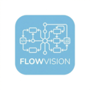
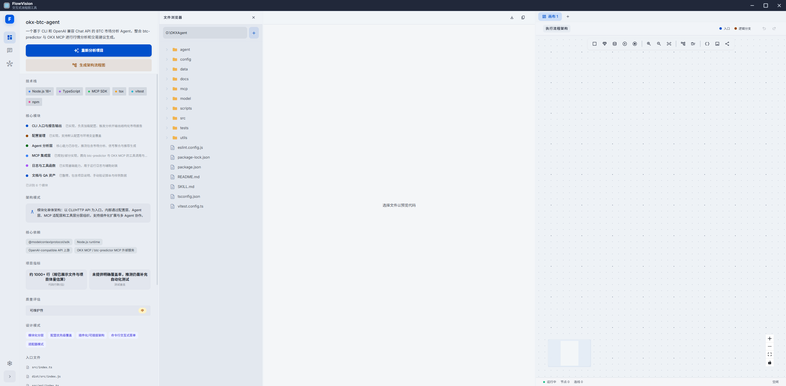
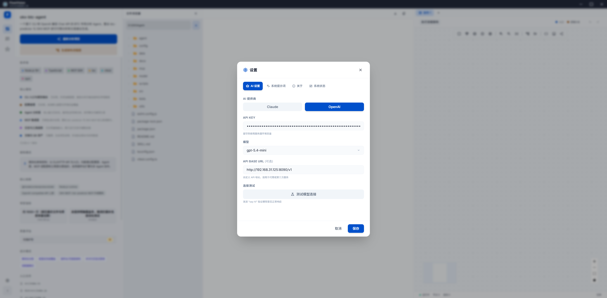

<div align="center">



## 🔮 FlowVision

**AI 驱动的智能流程图设计工具**

一键分析项目代码 · 自动生成架构流程图 · 可视化编辑 · MCP 实时同步

[](LICENSE) [](https://nodejs.org) [](https://pnpm.io) [](https://react.dev) [](https://www.electronjs.org) [](../../releases)

</div>

---

## 功能亮点

<table>
<tr>
<td width="50%">

### AI 智能生成

用自然语言描述需求，AI 自动生成完整流程图。
支持 OpenAI / Anthropic / DeepSeek / Ollama 多模型。

</td>
<td width="50%">

### 项目分析

导入本地或 GitHub 项目，AI 深度分析代码结构、
技术栈、设计模式，生成可视化架构图。

</td>
</tr>
<tr>
<td>

### 可视化编辑

拖拽节点与连线，39 种节点类型覆盖 8 种图表（流程图、ER图、类图、时序图、
用例图、状态图、活动图、功能结构图），四向连接，自动布局，撤销 / 重做，导出 PNG / JSON / Markdown。

</td>
<td>

### MCP 协议集成

内置 MCP 服务器，支持 Claude Desktop、Cursor、
VS Code 等 AI 客户端实时同步操作流程图。

</td>
</tr>
<tr>
<td>

### 斜杠命令系统

输入 `/` 快速调用命令，支持清空对话、新建会话、
导出对话、思考模式切换、模板切换、快速调用模板。

</td>
<td>

### AI Prompt 生成

AI 辅助生成高质量流程图 Prompt，描述场景即可
获得优化的提示词，提升流程图生成质量。

</td>
</tr>
</table>

## 截图展示

| 主界面                                   | 设置面板                                       |
| ---------------------------------------- | ---------------------------------------------- |
|  |  |

## 快速开始

### Web 开发模式

```bash
# 1. 克隆仓库
git clone https://github.com/YangXiaoMian/FlowVision.git
cd FlowVision

# 2. 安装依赖
pnpm install

# 3. 启动开发环境（前端 + 后端）
pnpm dev
```

前端运行在 `http://localhost:5173`，后端运行在 `http://localhost:3001`。

### 桌面应用

FlowVision 提供 Electron 桌面端，支持 Windows、macOS、Linux 三平台：

```bash
# 1. 安装依赖
pnpm install

# 2. 构建桌面应用（会先编译前后端，再执行 electron-builder）
pnpm build:desktop

# 3. 发布前检查（先跑测试，再构建桌面端并执行 share / 新画布 smoke）
pnpm release:check

```

构建完成后，安装包输出在 `packages/desktop/dist/` 目录。

| 平台    | 格式        | 说明        |
| ------- | ----------- | ----------- |
| Windows | `.exe`      | NSIS 安装包 |
| macOS   | `.dmg`      | 磁盘镜像    |
| Linux   | `.AppImage` | 免安装运行  |

> **自动构建**：推送版本号格式的标签（如 `1.0.0`）会触发 GitHub Actions 自动编译三平台安装包，可在 [Releases](../../releases) 页面下载。

> **macOS 签名说明**：macOS 构建需要有效的 Apple 开发者证书，否则 `.dmg` 安装后会提示"未知开发者"，用户需在「系统设置 → 隐私与安全性」中手动允许打开。如需绕过，可在下载后执行：
>
> ```bash
> xattr -cr /Applications/FlowVision.app
> ```

## 技术架构

```
flowvision/
├── packages/
│   ├── frontend/      React 18 · TypeScript · React Flow · Zustand · Tailwind CSS
│   ├── backend/       Fastify · Node.js · SSE 流式传输 · WebSocket
│   ├── analyzer/      代码分析引擎 · AI 驱动的架构提取
│   └── desktop/       Electron 桌面壳 · 跨平台打包
├── turbo.json         Turborepo 构建编排
└── pnpm-workspace.yaml
```

<details>
<summary><b>完整技术栈</b></summary>

| 层       | 技术                                                                     |
| -------- | ------------------------------------------------------------------------ |
| **前端** | React 18 · TypeScript · React Flow v12 · Zustand · Tailwind CSS · Vite 5 |
| **后端** | Fastify · Node.js · SSE · WebSocket                                      |
| **AI**   | OpenAI · Anthropic · DeepSeek · Ollama 多模型切换                        |
| **MCP**  | @modelcontextprotocol/sdk · 27 个标准工具                                |
| **桌面** | Electron · electron-builder                                              |
| **构建** | pnpm 9 · Turborepo · GitHub Actions CI/CD                                |

</details>

## MCP 集成

FlowVision 暴露 27 个 MCP 工具，AI 客户端可直接操作流程图：

| 工具              | 说明                       |
| ----------------- | -------------------------- |
| `get_graph`       | 获取当前流程图完整结构     |
| `add_node`        | 添加节点                   |
| `remove_node`     | 删除节点                   |
| `update_node`     | 更新节点属性               |
| `connect_nodes`   | 连接两个节点               |
| `apply_diff`      | 批量变更（增 / 删 / 改）   |
| `list_nodes`      | 列出所有节点摘要           |
| `get_node`        | 获取单个节点详情           |
| `get_stats`       | 获取图统计信息             |
| `clear_graph`     | 清空画布                   |
| `remove_edge`     | 删除指定连线               |
| `search_nodes`    | 按关键词搜索节点           |
| `get_subgraph`    | 获取节点及其连通子图       |
| `update_edge`     | 修改连线标签 / 类型 / 动画 |
| `export_graph`    | 导出为 Mermaid 格式文本    |
| `batch_add_nodes` | 批量添加多个节点           |
| `batch_connect_nodes` | 批量创建多条连线       |
| `auto_layout`     | 触发自动布局               |
| `validate_graph`  | 验证图表完整性             |
| `get_diagram_info`| 获取当前图表类型和配置     |
| `clone_node`      | 克隆指定节点               |
| `move_node`       | 移动节点位置               |
| `set_diagram_type`| 设置图表类型               |

<details>
<summary><b>客户端配置</b></summary>

在 Claude Desktop、Cursor 或其他 MCP 客户端中添加：

```json
{
  "mcpServers": {
    "flowvision": {
      "url": "http://localhost:3001/mcp"
    }
  }
}
```

</details>

## API

<details>
<summary><b>REST 端点</b></summary>

| 方法 | 路径                      | 说明            |
| ---- | ------------------------- | --------------- |
| POST | `/api/ai/generate`        | 同步生成流程图  |
| POST | `/api/ai/generate-stream` | 流式生成（SSE） |
| POST | `/api/analyze`            | 分析项目代码    |
| GET  | `/api/files`              | 读取项目文件树  |
| GET  | `/health`                 | 健康检查        |

</details>

## 快捷键

| 快捷键   | 功能         |
| -------- | ------------ |
| `Ctrl+Z` | 撤销         |
| `Ctrl+Y` | 重做         |
| `Ctrl+E` | 导出 PNG     |
| `Delete` | 删除选中节点 |

## 未来规划

| 状态      | 功能                                              |
| --------- | ------------------------------------------------- |
| ✅ 已完成 | AI Prompt 生成子页面                              |
| ✅ 已完成 | 斜杠命令系统（/help /clear /export 等）           |
| ✅ 已完成 | 下载操作 Toast 通知                               |
| ✅ 已完成 | 文件浏览器状态持久化                              |
| ✅ 已完成 | 四向连接接口与贝塞尔连线                          |
| ✅ 已完成 | 统计面板（语言 / Token / 图表分析）               |
| ✅ 已完成 | Agent 日志详情展开                                |
| ✅ 已完成 | 增强数据备份（单项导出 / 标签页持久化）           |
| ✅ 已完成 | MCP 工具集完善（27 个工具，支持所有图表类型）     |
| ✅ 已完成 | Prompt 生成支持画布与项目上下文选择               |
| ✅ 已完成 | 模板命令（/template）                             |
| ✅ 已完成 | 39 种节点类型（流程图/ER/类图/时序图/用例图/状态图/活动图/功能结构图） |
| ✅ 已完成 | 15 个场景模板 + 13 种图表类型模板                 |
| ✅ 已完成 | 增强 AI 提示词（完整节点参考、边关系、数据字段）   |
| 规划中    | 多人协作实时编辑（WebRTC / CRDT）                 |
| 规划中    | 流程图版本历史与对比                              |
| 规划中    | 自定义节点模板市场                                |
| 规划中    | 导出为可执行代码（Python / TypeScript / Mermaid） |
| 规划中    | 移动端适配（PWA）                                 |
| 规划中    | 本地 AI 模型增强支持（LM Studio / llama.cpp）     |
| 规划中    | 插件系统：自定义分析器与导出器                    |
| 规划中    | 代码注释与流程图双向同步                          |
| 规划中    | AI 生成结果可编辑提示词（Prompt Tuning）          |

## 许可证

[MIT](LICENSE)

## Star 趋势

<a href="https://star-history.com/#znc15/FlowVision&Date">
  <picture>
    <source media="(prefers-color-scheme: dark)" srcset="https://api.star-history.com/svg?repos=znc15/FlowVision&type=Date&theme=dark" />
    <source media="(prefers-color-scheme: light)" srcset="https://api.star-history.com/svg?repos=znc15/FlowVision&type=Date" />
    
  </picture>
</a>

## 友情链接

- [LinuxDo](https://linux.do/) - Linux.do论坛
- [React](https://react.dev/) - React 官方文档
- [Electron](https://www.electronjs.org/) - Electron 官方网站
- [Vite](https://vite.dev/) - Vite 官方文档
- [Fastify](https://fastify.dev/) - Fastify 官方文档
- [Model Context Protocol](https://modelcontextprotocol.io/) - MCP 官方文档
- [pnpm](https://pnpm.io/) - pnpm 官方文档
